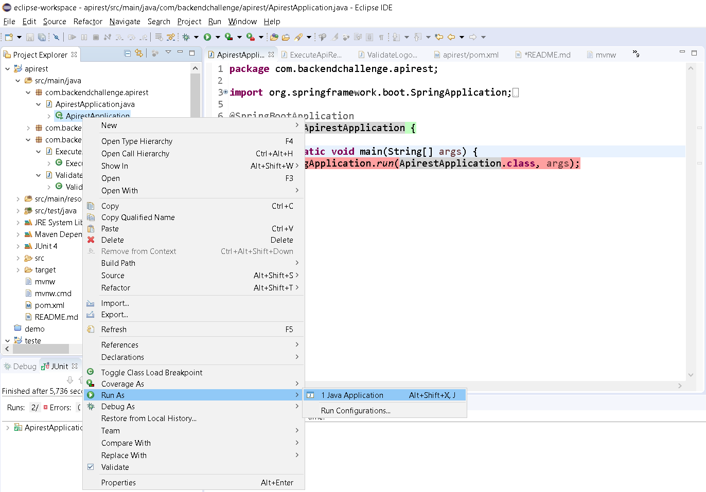
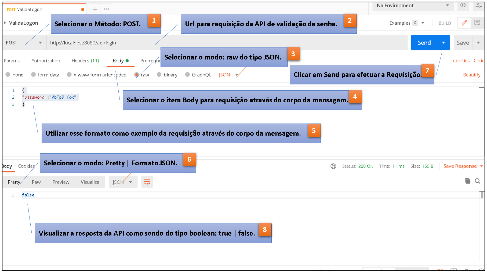

<p align="center">
  
</p>


### Sobre

O projeto **password-validation** expõe uma api web que valida se uma senha é válida.

### Tecnologias

O projeto foi desenvolvido utilizando as seguintes tecnologias.

* [Official Apache Maven documentation](https://maven.apache.org/guides/index.html)
* [Spring Boot Maven Plugin Reference Guide](https://docs.spring.io/spring-boot/docs/2.5.0/maven-plugin/reference/html/)
* [Create an OCI image](https://docs.spring.io/spring-boot/docs/2.5.0/maven-plugin/reference/html/#build-image)
* [Spring Web](https://docs.spring.io/spring-boot/docs/2.5.0/reference/htmlsingle/#boot-features-developing-web-applications)
* [Spring Boot DevTools](https://docs.spring.io/spring-boot/docs/2.5.0/reference/htmlsingle/#using-boot-devtools)
* [Regex](https://regexr.com/)

* [Postman](https://www.postman.com/downloads/)

* [Eclipse](https://www.eclipse.org/downloads/packages/release/2021-03)


### Como baixar o projeto

```bash
# Clonar repositório
$ git clone https://github.com/probins7/password-validation.git
```

### Detalhes sobre a solução

- Para desenvolver a solução foram utilizadas os frameworks  **Spring Boot** com o **Sprint MVC** Spring Boot e Spring MVC. O primeiro nos ajuda com tarefas de infraestrutura do nosso projeto e o segundo nos ajuda a tratar requisições web.
- Foi utilizado o **Maven** que é um gerenciador de build e dependências baseado no conceito de project object model (POM). Traduzindo, ele permite configurar as dependências dos projetos apontando para os identificadores das mesmas num arquivo chamado pom.
- Para atender as premissas de validação de senha, utilizei-me da implementação de uma **expressão regular**, ou **Regex**, são padrões utilizados para identificar determinadas combinações ou cadeias de caracteres em uma string.

```java
// Validação da Regex 
// Informa se esta string corresponde ou não à expressão regular fornecida.
// Uma invocação deste método da forma str.matches (regex) produz exatamente o mesmo resultado da expressão.

boolean java.lang.String.matches (String regex)
```

- Para validação da senha foram consideradas as seguintes regras:

```java
IsValid("") // false  
IsValid("aa") // false  
IsValid("ab") // false  
IsValid("AAAbbbCc") // false  
IsValid("AbTp9!foo") // false  
IsValid("AbTp9!foA") // false
IsValid("AbTp9 fok") // false
IsValid("AbTp9!fok") // true
```

### Detalhes sobre a execução

A API poderá ser executada localmente sendo a requisação http efetuada confome orientação abaixo também através da ferramenta Postman.

Para executar a API, você podera importá-la para dentro de uma IDE **eclipse** e seguir algumas orientações conforme abaixo:

 1. Importar o Projeto password_validation para dentro da sua IDE;

 2. Selecionar a classe **Password_ValidationApplication**, e através do botaão direito selecionar **Run As** e em seguida selecione **Java Aplication**, conforme o exemplo abaixo:

<p align="center">
  
</p>

 3. Após Start da Aplicação, Utilizar a ferramenta Postman para efetuar a requisição da API.

 - Exemplo da Execução: http://localhost:8080/api/login

 <p align="center">
  
</p>

- Observações sobre o **input** e o **output** da requisição:

1. No o input devará ser enviada a senha do tipo (String), passando-a no formato Json através do corpo da requisição.

```java
// Request da Requisição no formato Json.
```

```Json
{
"password":"AbTp9 fok"
}
```

2.  Para a área de Saída é esperado um boolean indicando se a senha é válida (true) ou inválida (false).

```java
// Response da Requisição no formato boolean.
```

```java
false
```
